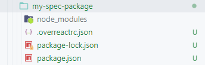
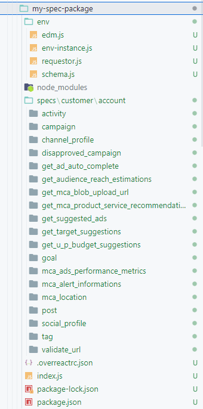

# `overreact-odata` generator

We created a Yeoman generator to auto-generate specs and data hooks, if the service talks OData. The source code of the generator can be found [here](https://github.com/microsoft/overreact-core/tree/main/packages/generator-overreact-odata) and it is published on NPM [here](https://www.npmjs.com/package/generator-overreact-odata).

## Installation

To use the generator, you must have [yo](https://yeoman.io/learning/index.html) and the generator itself installed.

```bash
$ yarn global add yo generator-overreact-odata
```

## Bootstrapping your spec package

In your working directory:

```bash
~$ mkdir my-spec-package
~$ cd my-spec-package
~/my-spec-package$ yo overreact-odata:generator
```

It will ask a few questions to get started:

```
Looks like this is the first time you're generating this package.
Let's start with gathering some basic information.
? Your package name (my spec package):
```

Enter a name for your package, and hit Enter:

```
? OData metadata endpoint URL:
```

Enter the URL of the OData endpoint (e.g., `https://ui.ads-int.microsoft.com/ODataApi/Mca/V1/`). Note that we don't need to include the `$metadata` part.

The generator will then start bootstrapping your spec package:

```
Fetching metadata from https://ui.ads-int.microsoft.com/ODataApi/Mca/V1/
Metadata fetched.
   create package.json
   create .overreactrc.json

Changes to package.json were detected.

Running npm install for you to install the required dependencies.
npm notice created a lockfile as package-lock.json. You should commit this file.

added 15 packages from 10 contributors in 2.951s

Please modify "modelAliases" in .overreactrc.json, and run "yo overreact-odata" again.
```

## Defining model aliases

Now you'll have a barebone folder like this after the first run:



To continue with spec generation, you'll need to edit `.overreactrc.json` to select the EDM models you'd like to use. The generator will use the models you've selected to enumerate data paths to form the specs. Any models that are not present in the file would not appear in the generated data paths.

You can also add more models into the file. Please refer to [Schema](/concept/schema) for more details.

```json title=".overreactrc.json"
{
  "url": "https://ui.ads-int.microsoft.com/ODataApi/Mca/V1/",
  "modelAliases": {
    // note you can update the alias,
    // such as "mca_customer" -> "customer"
    "mca_customer": "Model/McaCustomer",

    "social_profile": "Model/SocialProfile",
    "post": "Model/Post",
    "activity": "Model/Activity",
    "channel_user": "Model/ChannelUser",

    "mca_campaign": "Model/McaCampaign",

    // schema alias
    "disapproved_campaign": "Model/McaCampaign"

    "mca_ad": "Model/McaAd",
    "target": "Model/Target",
    "mca_location": "Model/McaLocation",
    "channel_profile": "Model/ChannelProfile",
    "mca_tag": "Model/McaTag",

    // and more schema that might not exist in metadata
    "suggested_ad": "SuggestedAd",

    // ...
  }
}
```

After the model aliases has been defined, run the generator again. This time the generator will ask for environment tag and root properties. *Environment tag* is used by overreact's `Environment` class as a distinguishable identifier among various environments, while *root property* is the property from which all other models are navigated from. In OData representation, this is usually the first segment of the URL. For example, in the following request:

```
https://services.odata.org/v4/TripPinServiceRW/Customers(123)/Accounts(456)/
```

The root property *name* would be `Customers`, and its *model name* would be `Model/McaCustomer`, as defined in the `modelAliases` property in `.overreactrc.json`.

```
~/my-spec-package$ yo overreact-odata:generator
? Enviroment tag MyEndpoint
? What is the name of the root property? Customers
? Please provide the model name for the root property Model/McaCustomer
Fetching metadata from https://ui.ads-int.microsoft.com/ODataApi/Mca/V1/
Metadata fetched.

identical package.json
 conflict .overreactrc.json
? Overwrite .overreactrc.json? overwrite
    force .overreactrc.json

No change to package.json was detected. No package manager install will be executed.
Please modify "specList" in .overreactrc.json, and run "yo overreact-odata" again to generate spec files.
```

## Cherry-picking specs

After the second run, `.overreactrc.json` file will contain a new property called `specList`, which includes configurations for all specs to be generated:

```json
"specList": {
    "customer": [
      {
        "type": "entity",
        "name": "useCustomer",
        "dataPath": "customer"
      },
      {
        "type": "coll",
        "name": "useCustomers",
        "dataPath": "customer"
      }
    ],
    "customer:account": [
      {
        "type": "entity",
        "name": "useAccount",
        "dataPath": "customer:account"
      },
      {
        "type": "coll",
        "name": "useAccounts",
        "dataPath": "customer:account"
      }
    ],
    "customer:account:get_link_preview": [
      {
        "type": "call",
        "name": "useGetLinkPreview",
        "dataPath": "customer:account:get_link_preview"
      }
    ],
    // ...
}
```

Each spec contains a name, and a list of configurations:

```json
  "spec_name": [
     "config1": {
        "type": "entity",
        "name": "useSpecName",
     },
     "config2": {
        // ...
     },
     // ...
  ]
```

This table explains that the config object should include:

| Key | Value | Remarks |
| --- | ----- | ------- |
| type | `entity` \| `coll` \| `call` | Type of the spec. `call` includes Action and Function |
| name |  | The name of the data hook, `useAbc`, where "Abc" is the name of the last model in the data path in pascal case. If `type` is `coll`, it'll be pluralized (i.e., `useAbcs`) |
| dataPath |  | This is the same `dataPath` in request contracts used by overreact |

At this moment, however, the actual specs are still not generated yet. This is to give you a chance to edit the `specList` property and cherry pick the specs that are useful to you.

:::info

Even after the spec files are generated, you can still update `specList` to either remove, or introduce new specs, by adding the new specs/configurations into the property, and running the generator again.

:::

## Generating spec files

Finally, once you have a curated `specList` configured, run the generator one more time to generate the actual spec files:

```bash
~/my-spec-package$ yo overreact-odata:generator
Fetching metadata from https://ui.ads-int.microsoft.com/ODataApi/Mca/V1
Metadata fetched.
identical package.json
identical .overreactrc.json
   create env\edm.js
   create env\env-instance.js
   create env\schema.js
   create env\requestor.js
   create specs\customer\account\get_u_p_budget_suggestions\__specs\calls\action-spec.js
   create specs\customer\account\get_u_p_budget_suggestions\__hooks\calls\action-hook.js
   ...
   create index.js

No change to package.json was detected. No package manager install will be executed.
Spec files generated.
```

And the folder will now look like this:



At this time, all the basic specs and data hooks are generated in their respective folders under the `specs` subfolder in the package. Specs for entity/collection operations are located in the object model's `__hook` and `__specs` folder directly, while any OData Action/Functions will have dedicated sub-folders named after the call itself:

```
specs\customer\account
  |-- activity
  |-- campaign
      |-- __hooks
          |-- coll
              |-- coll-hook.js         <-- hooks for Campaign collection operations
          |-- entity
      |-- __specs
      |-- associate_profile
          |-- __hooks
              |-- calls
                  |-- action-hook.js   <-- hooks for Campaigns/AssociateProfile call
          |-- __specs
```

However if you open any of the .js files, you'll probably notice some errors saying something like this:

> Unable to resolve path to module './hook-decorators'

This is because we're missing *decorators*. Decorators are additional files to provide customization to the generated specs, so that developers could provide extra control over how the data hooks/specs should behave. If you're familiar with overreact, you can manually write the decorators (by creating the missing files and export the desired decorator functions), or, you can run the generator one more time:

```bash
~/my-spec-package$ yo overreact-odata:generator --decorators
```

Notice the new `--decorators` switch added to the command line. This tells the generator to create additional decorators to make the folder look like this:

```
specs\customer\account
  |-- activity
  |-- campaign
      |-- __hooks
          |-- coll
              |-- coll-hook.js
              |-- hook-decorators.js   <-- hook decorators
          |-- entity
      |-- __specs
          |-- coll
              |-- add-spec.js
              |-- add-decorators.js    <-- collection decorators for add operation
      |-- associate_profile
          |-- __hooks
              |-- calls
                  |-- action-hook.js
          |-- __specs
```

Those decorators provide a way to perform additional operations beyond what has been generated for you. Take a look at the generated decorator.js files to try it out yourself!

## Adding more specs

It is generally recommended to incrementally add more data hooks and specs only when they're needed. This keeps the package small and took overreact less time to initialize. 

When a new hook is indeed needed, all you need to do is follow the steps listed below to create new specs for the new operation:

1. Add new model alias to the `.overreactrc.json` file.
2. Add new spec into `specList` section in the same file, making sure the spec names and its corresponding data path segments includes the same model aliases added in previous step.
3. Run the generator again with `--decorators` flag. This will make the generator create decorator files alongside the spec and hook definition files.

:::tip
Sometimes it is difficult to manually construct the spec configuration object in `specList`. An eaiser way is
to make a backup copy of the `.overreactrc.json` file, then create a new `.overreactrc.json` with everything from the original file, _except_ the `specList` object. After that, run the generator again and the full `specList` will be created for you, from which you can look for the desired specs, and copy the definitions over to the original `.overreactrc.json` file.
:::